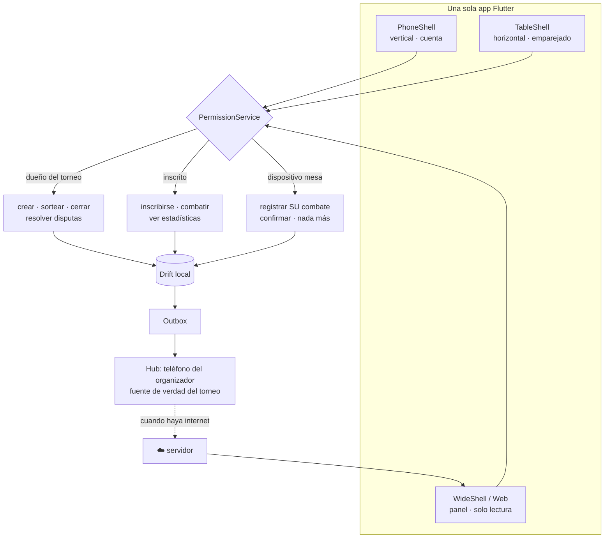

# Cómo se separan admin, usuario y mesa

## La respuesta corta

**No son tres apps. Son tres ejes independientes que se estaban confundiendo en uno.**

| Eje | Qué es | Valores | Se decide |
|---|---|---|---|
| **Superficie** | dónde se ve | teléfono · mesa · panel web | por dispositivo |
| **Identidad** | quién eres | cuenta personal · dispositivo emparejado | al iniciar |
| **Capacidad** | qué puedes hacer | 12 capacidades por recurso | se calcula, no se asigna |

"Admin" no es un valor de ninguno de los tres. **Admin es el resultado** de tener capacidades de gestión sobre un torneo concreto.

Si haces tres apps separadas, el primer problema aparece el día uno: **el organizador también compite.** Tendría que cambiar de app entre resolver una disputa y jugar su combate. Y eso no es un caso raro, es lo normal en un torneo de barrio.

---

## 1. Las iteraciones

### Iteración 1 — Tres apps separadas

```
BeyScore Admin  ·  BeyScore  ·  BeyScore Mesa
```

**Se cae por:**
- El organizador compite → dos apps instaladas, cambio constante
- Tres binarios, tres publicaciones en tienda, tres ciclos de release
- El dominio (puntuación, catálogo, sincronización) se duplica o vive en un paquete compartido que igual hay que versionar tres veces
- Un jugador que quiere organizar un torneo tiene que descubrir e instalar otra app

**Lo único que salvaba:** la mesa sí es distinta de verdad. Guardo eso.

### Iteración 2 — Una app, un shell por superficie

```
BeyScore
├── PhoneShell      vertical, cuenta personal
├── TableShell      horizontal, dispositivo emparejado
└── WideShell       web/escritorio, panel
```

Mejor. El organizador es la misma app con más controles dentro del torneo que organiza.

**Pero queda una duda:** ¿el panel de resultados va en el teléfono? Un cuadro de 32 personas y una tabla de estadísticas no caben. Y el organizador **sí** quiere verlo en un portátil el día siguiente.

### Iteración 3 — El panel es Flutter Web

Mismo código, ruta `/dashboard`, se abre en el navegador de un portátil. Cero binario nuevo, cero mantenimiento extra. Es de **solo lectura**: mirar resultados en el portátil es una cosa; gestionar el torneo en vivo se hace desde el teléfono, que es lo que llevas encima en el salón.

### Iteración 4 — ¿Y la mesa entonces qué es?

La mesa **no es un rol de usuario**. Es un **rol de dispositivo**:

```dart
enum DeviceRole { personal, table }
```

Una mesa no inicia sesión con la cuenta de nadie. Se empareja con un torneo y un número de mesa. Por eso puede registrar el combate que tiene delante y nada más.

Esto lo verifiqué contra el `PermissionService` que ya existía y **no hubo que añadir ninguna excepción**. Cae solo.

---

## 2. La matriz

|  | Teléfono personal | Mesa | Panel web |
|---|---|---|---|
| **Identidad** | cuenta | dispositivo emparejado | cuenta (lectura) |
| **Orientación** | vertical | horizontal fija | libre |
| **Armar combo / deck** | ✅ | ❌ | ❌ |
| **Inscribirse** | ✅ | ❌ | ❌ |
| **Ver mis estadísticas** | ✅ | ❌ | ✅ |
| **Registrar resultado** | ✅ su combate | ✅ el de su mesa | ❌ |
| **Confirmar resultado** | ✅ | ✅ ambos presentes | ❌ |
| **Crear torneo** | ✅ | ❌ | ❌ |
| **Sortear · cerrar ronda** | ✅ si es staff | ❌ | ❌ |
| **Resolver disputa** | ✅ si es staff y no juega | ❌ | ❌ |
| **Cuadro completo** | limitado | ❌ | ✅ |
| **Analítica y exportar** | resumen | ❌ | ✅ |

---

## 3. Lo que pediste, concreto

### El usuario (competidor)

```
Registrarse            → alias, categoría de edad
Mis beys               → armar combos: BX / UX / CX
Mis decks              → 3 beys, validación de piezas no repetibles
Torneos                → buscar, inscribirse con un deck
Día del evento         → check-in, chequeo de deck (QR), a la mesa
Combatir               → en la mesa, o en su teléfono si no hay tablet
Perfil                 → victorias, racha, tipos de finish, ranking local
```

### El organizador

```
Crear torneo           → 3 pasos: datos · formato y reglas · inscripción
Gestionar inscritos    → ver decks, marcar los ilegales, avisar
Día del evento         → check-in, chequeo de decks, sorteo con semilla
En vivo                → panel de mesas, disputas, cerrar rondas
Después                → panel web: cuadro, ranking, analítica, CSV
```

**Es la misma app.** Cuando abre un torneo del que es dueño, aparecen los controles. Cuando abre uno ajeno, no. Sin pestaña de administración, sin modo admin.

### La mesa

```
Emparejarse            → escanea el QR del torneo, elige nº de mesa
Reposo                 → muestra su número y quién viene
Combate asignado       → VS → tap to ready → cuenta atrás → marcador
Al terminar            → confirman los dos, vuelve a reposo
Desacuerdo             → se bloquea y llama al juez
```

---

## 4. Cómo se conectan

Aquí está la parte que hay que decidir de verdad, y depende de si hay internet en el salón.

### Etapa 1 — Sin sincronización

Un dispositivo lleva todo el torneo. Funciona para 8 personas y una mesa. Es lo que hay que construir primero porque ya es útil.

### Etapa 2 — Hub en el teléfono del organizador (LAN)

**Esta es la que resuelve el problema real: salones sin internet.**

```
        ┌──────────────┐
        │  Mesa 1      │──┐
        └──────────────┘  │
        ┌──────────────┐  │   HTTP en red local
        │  Mesa 2      │──┼──▶ ┌─────────────────────┐
        └──────────────┘  │    │  Teléfono del       │
        ┌──────────────┐  │    │  ORGANIZADOR        │
        │  Mesa 3      │──┘    │  = fuente de verdad │
        └──────────────┘       └──────────┬──────────┘
        ┌──────────────┐                  │
        │ Teléfonos    │──────────────────┘
        │ de jugadores │        cuando vuelva internet
        └──────────────┘                  │
                                          ▼
                                    ☁️  servidor
```

- El teléfono del organizador levanta un servidor local (`shelf` + mDNS para que las mesas lo encuentren solas).
- Las mesas y los jugadores sincronizan contra él por wifi local o por el hotspot del propio organizador.
- Cuando vuelve internet, ese teléfono sube todo a la nube.

Coherente con lo que ya decidimos: **el dispositivo del organizador es autoritativo para el estado del torneo.** Aquí se vuelve literal.

### Etapa 3 — Servidor en la nube

Necesario solo para ranking entre torneos, panel web y cuentas. El `SyncEngine` con Outbox ya está preparado: cambia el `RemoteDataSource` y nada más.

---

## 5. Identidad y emparejamiento

| | Cómo se identifica | Cómo caduca |
|---|---|---|
| Usuario | cuenta (alias + email) | cierra sesión |
| Organizador | la misma cuenta, + `Tournament.ownerId` | al terminar el torneo |
| Mesa | token de emparejamiento por dispositivo, sin cuenta | al cerrar el torneo o a las 12 h |

```dart
class TablePairing {
  final String tournamentId;
  final int tableNumber;
  final String deviceToken;      // firmado por el organizador al emparejar
  final DateTime expiresAt;      // fin del torneo, o 12 h
}
```

El token lo firma el organizador al emparejar. Sin firma, la mesa puede seguir registrando sin conexión, pero **todo lo que registre queda provisional** y el organizador lo revisa. Es la misma regla que ya aplicamos a los nombramientos de juez.

---

## 6. Modos de fallo (y qué hace la app)

Iteré buscando dónde se rompe la separación. Estos son los que encontré:

| Fallo | Qué pasa | Respuesta |
|---|---|---|
| Mesa emparejada al torneo equivocado | Muestra combates de otro evento | El QR lleva el `tournamentId`; la mesa muestra siempre el nombre del torneo arriba |
| Dos tablets dicen ser la Mesa 3 | Ambas registran el mismo combate | El organizador ve el choque; la segunda entra en solo lectura hasta que él decida |
| Mesa sigue emparejada al día siguiente | Registra en un torneo terminado | `expiresAt` + el estado `FINISHED` deniega `recordMatchResult` |
| Muere el teléfono del organizador | Se cae el hub | Las mesas siguen guardando local. Al volver, sincronizan. El lock caduca a los 30 min |
| Jugador sin conexión, la mesa registró | No ve su resultado | Le llega al sincronizar; su teléfono nunca fue la fuente de verdad |
| Alguien abre modo mesa en su móvil para hacer trampa | Registra resultados falsos | Sin token firmado → todo provisional y marcado. El organizador lo ve |
| Panel web con datos viejos | Se decide sobre datos caducos | Marca de hora visible siempre y aviso si pasan más de 2 min sin refrescar |
| Dos mesas y un jugador en las dos | Imposible físicamente, pero el software lo permitiría | Un combate solo puede tener una mesa asignada; el `writerLock` lo garantiza |

---

## 7. Diagrama



---

## 8. Qué construir y en qué orden

1. **PhoneShell** — combos, decks, combate 1v1 local. *Ya es un producto.*
2. **Torneos en un solo dispositivo** — crear, sortear, cuadro, resultados
3. **TableShell** — emparejamiento, VS, cuenta atrás, marcador espejado
4. **Hub LAN** — el teléfono del organizador sirve a las mesas
5. **Servidor + cuentas** — ranking entre torneos
6. **Panel web** — cuadro completo, analítica, exportar

Los pasos 1–3 no necesitan servidor. El 4 es el que hace posible un torneo real de varias mesas sin internet, y es donde está el valor diferencial.

---

## 9. La regla que resume todo

> **La superficie decide qué cabe en pantalla. La identidad decide quién eres. Las capacidades deciden qué puedes hacer. Son tres preguntas distintas y ninguna se responde con un `bool isAdmin`.**
