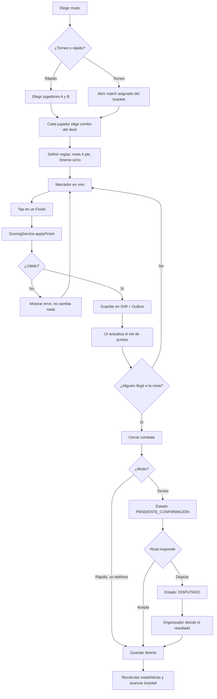
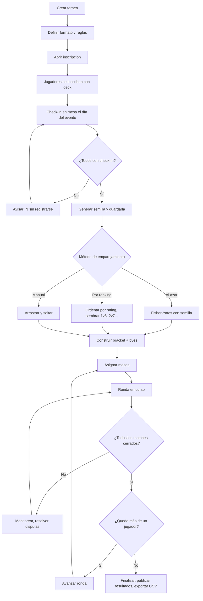
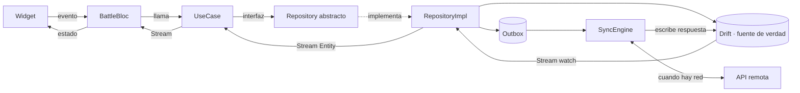

# BeyScore — Arquitectura Flutter (offline-first)

App móvil para registrar combates físicos de Beyblade X, gestionar torneos y ver estadísticas.
Clean Architecture + BLoC + RxDart. Escrito para escalar de "combate rápido entre dos amigos" a "torneo de 64 personas sin wifi".

---

## 0. Las cinco decisiones que mandan sobre todo lo demás

| # | Decisión | Consecuencia |
|---|---|---|
| 1 | **La unidad de dominio es el `Finish`, no el `Match`** | Los puntos son derivados. Nunca guardas un marcador editable; guardas hechos y sumas. Auditable y estadísticamente rico. |
| 2 | **Offline-first real, no "caché"** | La fuente de verdad para leer es SIEMPRE la base local (Drift). La red es un *sincronizador en segundo plano*, nunca está en el camino crítico de la UI. |
| 3 | **Escrituras vía Outbox + IDs generados en el cliente (UUID v7)** | Cada mutación se guarda local y se encola. Sin spinners de "guardando". Sin colisiones de ID al reconectar. |
| 4 | **`Match` con `tournamentId` nullable** | Un solo motor de combate para el modo rápido y el modo torneo. Nada duplicado. |
| 5 | **Admin es un permiso sobre un torneo, no un tipo de usuario** | El organizador casi siempre también compite. `Tournament.organizerIds` decide, no `User.role`. |

---

## 1. Estructura de carpetas

```
lib/
├── main.dart
├── bootstrap.dart                 # runZonedGuarded, DI, error handling
│
├── core/                          # sin dependencias de features
│   ├── di/
│   │   └── injector.dart          # get_it + injectable
│   ├── error/
│   │   ├── failure.dart           # sealed class Failure
│   │   └── exceptions.dart
│   ├── typedef/
│   │   └── result.dart            # typedef Result<T> = Either<Failure, T>
│   ├── usecase/
│   │   └── use_case.dart          # UseCase<Out, In>, StreamUseCase<Out, In>
│   ├── sync/                      # ← el corazón del offline-first
│   │   ├── outbox_entry.dart
│   │   ├── sync_engine.dart
│   │   ├── conflict_resolver.dart
│   │   └── connectivity_monitor.dart
│   ├── id/
│   │   └── uuid_v7_generator.dart
│   ├── extensions/
│   └── utils/
│
├── config/
│   ├── router/                    # go_router + guards por rol
│   ├── theme/                     # tokens: colores, tipografía, spacing
│   └── env/                       # flavors: dev / staging / prod
│
├── shared/                        # widgets y blocs transversales
│   ├── widgets/
│   │   ├── point_rail.dart        # el riel de puntos (elemento firma)
│   │   ├── sync_badge.dart
│   │   └── bey_combo_tile.dart
│   └── blocs/
│       ├── auth/
│       └── sync_status/           # global, escucha el SyncEngine
│
├── features/
│   ├── catalog/                   # piezas de Beyblade (semilla local)
│   │   ├── domain/
│   │   │   ├── entities/          part.dart, part_type.dart, system.dart
│   │   │   ├── repositories/      catalog_repository.dart  (abstracta)
│   │   │   └── usecases/          get_parts_by_type.dart, search_parts.dart
│   │   ├── data/
│   │   │   ├── models/            part_model.dart (fromJson/toEntity)
│   │   │   ├── datasources/
│   │   │   │   ├── catalog_local_datasource.dart      # Drift
│   │   │   │   └── catalog_remote_datasource.dart     # Dio
│   │   │   └── repositories/      catalog_repository_impl.dart
│   │   └── presentation/
│   │       ├── bloc/
│   │       ├── pages/
│   │       └── widgets/
│   │
│   ├── combo/                     # combos y decks del usuario
│   ├── battle/                    # ← núcleo: marcador en vivo
│   │   ├── domain/
│   │   │   ├── entities/
│   │   │   │   ├── match.dart
│   │   │   │   ├── battle_finish.dart
│   │   │   │   ├── finish_type.dart
│   │   │   │   └── match_rules.dart
│   │   │   ├── services/
│   │   │   │   └── scoring_service.dart   # PURO. Sin I/O. Aquí vive la regla.
│   │   │   ├── repositories/
│   │   │   └── usecases/
│   │   │       ├── start_match.dart
│   │   │       ├── register_finish.dart
│   │   │       ├── undo_last_finish.dart
│   │   │       └── watch_match.dart       # Stream
│   │   ├── data/
│   │   └── presentation/
│   │       ├── bloc/battle_bloc.dart
│   │       └── pages/live_battle_page.dart
│   │
│   ├── tournament/                # torneos, sorteo, bracket
│   │   └── domain/services/
│   │       ├── bracket_generator.dart     # PURO
│   │       └── seeded_shuffle.dart        # PURO, determinista
│   │
│   ├── stats/                     # estadísticas derivadas
│   └── profile/
│
└── l10n/                          # es / en desde el día uno
```

**Regla de dependencias, sin excepciones:**
`presentation → domain ← data`. El dominio no importa Flutter, ni Drift, ni Dio. Si `domain/` compila en un `dart:io` puro, la capa está bien hecha.

---

## 2. Dónde vive cada regla del juego

La tentación es meter la lógica de puntos en el BLoC. No lo hagas: el BLoC es infraestructura de UI y no se puede testear sin bombear eventos.

```dart
// features/battle/domain/services/scoring_service.dart
// Función pura. Test unitario sin mocks, sin async, sin nada.
class ScoringService {
  const ScoringService();

  int pointsFor(FinishType type) => switch (type) {
    FinishType.spin   => 1,
    FinishType.over   => 2,
    FinishType.burst  => 2,
    FinishType.xtreme => 3,
  };

  MatchScore scoreOf(Match match) { /* fold sobre finishes */ }

  /// Un finish solo es válido si el combate sigue abierto.
  Either<Failure, Match> applyFinish(Match match, BattleFinish finish) {
    if (match.status.isClosed) return Left(MatchAlreadyClosedFailure());
    if (!match.rules.allowsXtreme && finish.type == FinishType.xtreme) {
      return Left(FinishNotAllowedFailure());
    }
    final updated = match.copyWith(finishes: [...match.finishes, finish]);
    return Right(_closeIfTargetReached(updated));
  }
}
```

El `BattleBloc` solo orquesta: recibe el tap, llama al use case, emite estado.

---

## 3. BLoC + RxDart — dónde RxDart se gana el sueldo

Seamos honestos: en 2026 `bloc` ya trae casi todo. RxDart **no** debe estar en todas partes. Estos son los cuatro lugares donde sí aporta:

**a) `debounceTime` en búsqueda del catálogo** (138+ piezas)
```dart
on<CatalogSearchChanged>(
  _onSearch,
  transformer: (events, mapper) =>
      events.debounceTime(const Duration(milliseconds: 300)).switchMap(mapper),
);
```

**b) `throttleTime` en los botones de finish** — evita el doble tap accidental en pleno grito de "¡Go Shoot!"
```dart
on<FinishRegistered>(
  _onFinish,
  transformer: (events, mapper) =>
      events.throttleTime(const Duration(milliseconds: 400)).asyncExpand(mapper),
);
```

**c) `Rx.combineLatest` para estado derivado de varias fuentes**
```dart
// El estado de sincronización que ve el usuario depende de 3 streams distintos.
Stream<SyncStatus> get syncStatus => Rx.combineLatest3(
  _connectivity.stream,
  _outbox.pendingCountStream,
  _engine.isRunningStream,
  (online, pending, running) => SyncStatus(online, pending, running),
).distinct();
```

**d) `BehaviorSubject` en el `SyncEngine`** — un suscriptor tardío necesita el último valor, no esperar al siguiente evento.

**Dónde NO usarlo:** no envuelvas cada repositorio en `Observable`, no uses `PublishSubject` como bus global de eventos entre features (eso destruye la trazabilidad), y no reemplaces `Either` por streams de error.

**Un solo `BattleBloc` por combate**, con estados `sealed`:
```dart
sealed class BattleState {}
final class BattleLoading extends BattleState {}
final class BattleInProgress extends BattleState {
  final Match match; final MatchScore score; final bool canUndo;
}
final class BattleFinished extends BattleState {
  final Match match; final ConfirmationStatus confirmation;
}
final class BattleFailure extends BattleState { final Failure failure; }
```

---

## 4. El motor offline-first

### Patrón Outbox

```
Usuario toca "BURST +2"
        │
        ▼
[1] Escribir el Finish en Drift  ─────► la UI ya reaccionó (stream local)
        │
        ▼
[2] Insertar OutboxEntry(op: CREATE_FINISH, payload, status: PENDING)
        │
        ▼
[3] SyncEngine (dispara al reconectar / cada 30s / al abrir la app)
        │
        ├── éxito ──► marcar SYNCED, aplicar respuesta del servidor
        └── falla ──► reintento con backoff exponencial (1s, 2s, 4s… máx 5)
                      tras 5 fallos ──► status: FAILED, se muestra al admin
```

### Esquema local (Drift)

Toda tabla sincronizable lleva:
```dart
TextColumn get id => text()();                        // UUID v7 del cliente
DateTimeColumn get updatedAt => dateTime()();
IntColumn get version => integer().withDefault(const Constant(0))();
BoolColumn get isDirty => boolean().withDefault(const Constant(false))();
BoolColumn get isDeleted => boolean().withDefault(const Constant(false))(); // borrado lógico
```

### Resolución de conflictos, por tipo de dato

No hay una sola estrategia. Esto es lo que casi todo el mundo hace mal:

| Dato | Estrategia | Por qué |
|---|---|---|
| Catálogo de piezas | **El servidor gana siempre** | Es de solo lectura para el usuario. |
| Combos y decks | **Última escritura gana** (por `updatedAt`) | Un dueño único, conflicto casi imposible. |
| `BattleFinish` | **Append-only, unión de conjuntos** | Nunca se editan. Dos dispositivos que registran el mismo combate se fusionan por `(matchId, sequence)`. |
| Estado del torneo / bracket | **El dispositivo del organizador es autoritativo** | El bracket tiene una sola verdad. Los demás lo reciben. |
| Resultado en disputa | **Escalar al humano** | La app no adivina. Marca `DISPUTED` y el juez decide. |

Ese último renglón es la decisión más importante del documento: **un torneo real tiene un árbitro; la app no debe intentar reemplazarlo con un algoritmo.**

---

## 5. Diagramas de flujo

### 5.1 Flujo de un combate



### 5.2 Flujo del torneo (admin)



### 5.3 Flujo de datos por capas



Fíjate en la clave: **la respuesta de la API nunca va a la UI directamente.** Aterriza en Drift, y Drift le avisa a la UI por stream. Un solo camino de datos, un solo lugar donde depurar.

---

## 6. Stack sugerido

```yaml
dependencies:
  flutter_bloc: ^9.0.0
  rxdart: ^0.28.0
  get_it: ^8.0.0
  injectable: ^2.5.0
  drift: ^2.20.0            # SQLite tipado, streams reactivos nativos
  dio: ^5.7.0
  fpdart: ^1.1.0            # Either / Option
  freezed_annotation: ^2.4.4
  go_router: ^14.0.0
  connectivity_plus: ^6.0.0
  workmanager: ^0.5.2       # sync en segundo plano
  uuid: ^4.5.0
  intl: any

dev_dependencies:
  build_runner, freezed, injectable_generator, drift_dev,
  bloc_test, mocktail, very_good_analysis
```

**Cobertura de pruebas por capa:**
`domain/services` al 100% (son puros, no hay excusa) · use cases al 90% · blocs con `bloc_test` · `SyncEngine` con pruebas de integración simulando pérdida de red · widgets solo en flujos críticos.

---

## 7. Tres pasadas de autocrítica

Me pediste que me refute. Aquí van las tres objeciones más fuertes que le encuentro a lo anterior, y qué cambié.

### Pasada 1 — "Clean Architecture completa por feature es sobreingeniería para esta app"

**La objeción:** siete features × tres capas × (entities + repos + usecases + models + datasources + bloc) son unos 120 archivos antes de escribir una sola línea de lógica. Para una app de marcador esto se llama *parálisis por estructura*: un solo desarrollador tarda tres semanas en llegar a la primera pantalla funcional y abandona.

**Qué tiene de válido:** mucho. La mayoría de los proyectos Flutter que copian esta plantilla terminan con use cases de una línea que solo reenvían al repositorio — puro ruido.

**Lo que defiendo igual:** el `domain/` de `battle` y `tournament`. Ahí sí hay lógica de negocio real (validación de finishes, generación de brackets, avance de rondas) que debe ser testeable sin Flutter. Esa es la razón de ser de la capa, no la simetría.

**Corrección que aplico:** aplanar por feature según su complejidad, no de forma uniforme.
- `battle` y `tournament` → **las tres capas completas, con use cases.**
- `catalog`, `profile`, `stats` → **sin `usecases/`.** El BLoC llama directo al repositorio. Cuando un use case aparezca de verdad (más de un consumidor, o lógica propia), se extrae.
- Nunca crear un use case que solo haga `return repo.doThing()`.

Regla que me llevo: *la capa se gana su lugar cuando hay algo que proteger; si no protege nada, es burocracia.*

---

### Pasada 2 — "Última escritura gana va a perder resultados de combates"

**La objeción:** el escenario real es que en un torneo con 8 mesas, **dos dispositivos registran el mismo combate** — el jugador A en su teléfono y el juez en la tablet. Con "última escritura gana" por `updatedAt`, uno de los dos marcadores desaparece silenciosamente. Peor: los relojes de los teléfonos no están sincronizados, así que `updatedAt` ni siquiera es un orden confiable. Un jugador con el reloj adelantado 10 minutos gana todos los conflictos del torneo.

**Esto es un fallo real del diseño inicial, no un matiz.**

**Correcciones que aplico:**

1. **Los `BattleFinish` nunca se resuelven por timestamp.** Son append-only con clave `(matchId, playerId, sequence)`. La sincronización hace *unión*, no reemplazo. Si dos dispositivos registran la misma secuencia con distinto tipo de finish, eso no es un conflicto de datos: es un desacuerdo humano → `DISPUTED` → juez.

2. **Reloj lógico, no reloj de pared.** Cada mutación lleva un contador monótono por dispositivo (`deviceId` + `lamportCounter`). El `updatedAt` sirve para mostrar en la UI, jamás para decidir un conflicto.

3. **Un solo escritor por combate.** Al abrir el marcador, el dispositivo toma un `writerLock` del match (local si está offline, reclamado en el servidor al sincronizar). Los demás lo ven en modo lectura. Esto elimina el 95% de los conflictos en origen, que siempre es mejor que resolverlos bien.

4. **El "deshacer" es una entrada nueva, no un borrado.** `FinishVoided(targetFinishId)`. Nunca borres un hecho de una bitácora que otro dispositivo ya pudo haber replicado.

---

### Pasada 3 — "Las estadísticas calculadas al vuelo van a matar la app, y el diseño de rol es frágil"

**Objeción A — rendimiento:** la pantalla de estadísticas hace `fold` sobre todos los finishes del usuario. Con 48 combates va perfecto. Con 2.000 combates y agrupación por combo, por rival y por tipo de finish, son varios miles de filas escaneadas en cada `rebuild`, en el hilo de UI, sobre SQLite en un teléfono barato. Se siente lento justo en la pantalla que la gente presume.

**Corrección:** tabla `player_stats_snapshot` materializada, recalculada por evento cuando un match pasa a `CONFIRMED`, no en cada lectura. La lectura es un `SELECT` de una fila. El cálculo pesado corre en un `Isolate` (`compute`) para no bloquear el frame. Y como los finishes son append-only, la actualización es **incremental**: solo aplicas el delta del último combate. La reconstrucción completa queda como operación de reparación, disponible desde el panel de admin.

**Objeción B — el modelo de roles:** dije "admin es un permiso sobre el torneo, no un tipo de usuario", y aun así puse un tabbar de admin y una pantalla "Organizar". Eso es contradictorio: si el rol es contextual, no puede haber una sección global de admin.

**Corrección:** no existe un "modo admin". Existe un torneo del que eres organizador, y sus pantallas de gestión viven *dentro de ese torneo*. El router usa un guard por recurso, no por rol global:

```dart
GoRoute(
  path: '/tournament/:id/manage',
  redirect: (ctx, state) async {
    final id = state.pathParameters['id']!;
    final can = await ctx.read<PermissionService>().canManage(id);
    return can ? null : '/tournament/$id';
  },
)
```

**Objeción C — un supuesto que no verifiqué:** asumí un backend. Para un torneo de barrio puede que no haya ninguno, y "offline-first" se vuelva "offline-siempre". El diseño lo aguanta —la fuente de verdad ya es local—, pero hay que decidirlo explícitamente. Sugerencia: **empezar sin backend**, con la app 100% local y el juez como dispositivo maestro que exporta/importa el torneo por código QR o archivo JSON. El `SyncEngine` con Outbox ya está listo para que el día que exista un servidor solo cambie el `RemoteDataSource`. Eso es exactamente lo que Clean Architecture debía comprarte.

---

## 8. Orden de construcción sugerido

1. `core/` + tema + Drift con `catalog` semilla (piezas precargadas en el APK)
2. `combo` — armar y guardar combos. Todo local, sin red.
3. `battle` modo rápido — un teléfono, dos jugadores. **Aquí ya tienes un producto usable.**
4. `stats` con snapshot materializado
5. `meta` — tier list + "qué puedes armar". Barato: son datos que ya tienes.
6. `tournament` — sorteo, bracket, mesas
7. Confirmación entre dispositivos + `SyncEngine` + backend

Cada paso es una app que sirve por sí sola. Si el proyecto se detiene en el 3, igual tienes algo que la gente usa.

---

## 9. El catálogo real (v4 — tras encontrar una fuente completa)

Lo primero era una base comunitaria parcial. Lo definitivo es **BeybladeHub**, que tiene el catálogo entero con datos estructurados.

| | v3 (parcial) | v4 (completo) |
|---|---|---|
| Piezas | 138 | **222** |
| Blades | 56 | **68** + 66 componentes CX |
| Ratchets | 27 | **36** |
| Bits | 38 | **52** |
| Imágenes | 123/138 | **222/222** |

**Cobertura v4:**

| Campo | Cobertura |
|---|---|
| Nombre, tipo, imagen | 222/222 |
| Tipo de juego (ataque/defensa/stamina/balance) | 222/222 |
| Peso exacto en gramos | 60 blades |
| Clase de peso | 88 ratchets + bits |
| Altura, dientes, diámetro de eje | 84 ratchets + bits |
| Sentido de giro | 134 |
| Sets que la incluyen | 222 |

### Campos nuevos que valen la pena

- **`gearTeeth`** — dientes del engranaje del bit. Más dientes = Xtreme Dash más fuerte pero gasta más stamina. Es el compromiso central de Beyblade X y ahora es un dato consultable.
- **`shaftWidth`** — diámetro del eje. Determina cuánto cuesta deslizar el ratchet, o sea la resistencia al burst.
- **`heightDmm`** — altura en décimas de milímetro, con soporte para bits de altura conmutable (`115-130`).
- **`contactPoints`** — puntos de contacto del blade y del ratchet.
- **`hasbroAlias`** — HellsScythe se llama "Scythe Incendio" en occidente. Si tus usuarios compran cajas de Hasbro, buscarán por ese nombre.
- **`sets`** — en qué productos viene cada pieza. Habilita "¿qué me falta comprar para armar este combo?".

### Tipos de blade CX

El sistema CX tiene más subtipos de los que modelábamos: además de Lock Chip, Main Blade y Assist Blade, existen **Over Blade** y **Metal Blade**. El enum `PartType` los incluye ahora.

## 10. Cuarta pasada de autocrítica

Las tres primeras están arriba. Los datos reales obligan a una cuarta.

### "Diseñé el catálogo asumiendo datos completos, y llegaron incompletos"

**La objeción:** toda la pantalla de armado de combos asumía stats disponibles — barras de ataque/defensa/stamina, peso calculado, filtros por tipo. Con 2/138 piezas con triple numérico y 5/138 con peso, esa pantalla se ve **rota**: barras vacías, "0 g", filtros que no devuelven nada. Es el peor resultado posible: la app parece defectuosa cuando el defecto es del mundo.

**Por qué pasó:** diseñé la UI antes de mirar los datos. Error clásico y evitable.

**Correcciones:**

1. **Nullable en la base de datos, ausencia explícita en la UI.** Nunca un 0 donde falta un dato. La ficha dice: *"Takara Tomy no publica el triple de este blade"*. Un hueco honesto es mejor que un número inventado.

2. **Reordenar la jerarquía visual por disponibilidad real.** El peso y el tier tienen mejor cobertura que el triple numérico, y además importan más en juego competitivo. Suben; las barras bajan a "comparativa" y solo aparecen cuando hay datos.

3. **`comboWeight` devuelve null si falta cualquier pieza.** Ya está implementado así, y ahora sé por qué era la decisión correcta: sumar ceros habría mostrado "34.2 g" para un combo cuyo peso real se desconoce.

4. **Datos del usuario como primera clase.** Si mide su bey en una balanza de cocina, ese número gana sobre el catálogo. Con el tiempo, tus usuarios tienen mejores datos que cualquier web — y esos sí son tuyos.

### Objeción menor: el scraper es un punto de falla silencioso

Cuando pedí `blade.php?id=4`, el sitio me redirigió al índice y devolvió HTML válido. Un parser ingenuo habría guardado los stats del índice como si fueran de Hells Scythe. Por eso `parse()` **valida que el `h2` coincida con el nombre esperado y falla si no**. Regla general: cuando scrapeas, el fallo ruidoso siempre le gana al dato silenciosamente equivocado.

### Lo que todavía no verifico

- **Si los 138 son todos.** Es el conteo de un sitio comunitario que va detrás de los lanzamientos de Takara Tomy. Asume que el catálogo se queda corto y deja lista la ruta de actualización desde el día uno.
- **Si el triple attack/defense/stamina significa algo.** Viene del empaque de Hasbro, no de medición. La comunidad competitiva se guía por peso y forma, no por esos números. Considera mostrarlos como "según el empaque" y no como verdad de juego.

---

## 11. Quinta pasada de autocrítica

### "Derivé lo que debía haber buscado, y acerté el 32% de las veces"

**El error.** En la v3 escribí una regla que parecía sensata: deducir el tipo de un bit por su nombre. Flat y Rush suenan a ataque, Ball y Orb a defensa, Needle y Point a stamina. Y lo defendí con una frase que suena a principio de ingeniería: *"lo que puedas derivar, derívalo"*.

Al conseguir los datos reales, medí la heurística contra ellos:

> **52 bits · 14 acertados · 30 errados · 8 sin clasificar → 32% de acierto.**

Peor que tirar una moneda entre cuatro opciones. Ejemplos:

| Bit | Deduje | Real |
|---|---|---|
| Ball | defensa | **stamina** |
| Point | stamina | **balance** |
| Taper | stamina | **balance** |
| Needle | stamina | **defensa** |
| Wedge | ataque | **defensa** |
| Level | defensa | **ataque** |
| Kick | ataque | **balance** |

Ball es *el* bit más usado del juego competitivo, y lo tenía mal clasificado.

**Y los nombres tampoco eran correctos.** Seis piezas estaban mal:

`Disc Ball` → **Dumbbell** · `Gear Flat` → **Glide Flat** · `Gear Ball` → **Glide Ball** · `Gear Point` → **Glide Point** · `Gear Rush` → **Glide Rush** · `Low Flat` → **Launch Flat**

Un usuario que busca "Launch Flat" no habría encontrado nada. Y el filtro "bits de defensa" habría devuelto una lista mayormente equivocada, en la pantalla que se supone que ayuda a elegir piezas.

**Por qué falló el principio.** La regla no está mal, pero le faltaba una condición. Corregida:

> **Deriva solo cuando la derivación sea una definición, no una inferencia.**

`3-60` significa 3 picos y 60 de altura **por definición del sistema de nombres**: no puede fallar. Que `Ball` sea un bit de defensa era una *inferencia* mía sobre decisiones de diseño de Takara Tomy, y las inferencias sobre decisiones ajenas no son derivaciones — son suposiciones con buena presentación.

Prueba práctica: si no puedes escribir la regla como una función total sin excepciones, no es derivación. Es adivinanza, y hay que marcarla o buscar el dato.

**Corrección aplicada:** eliminé `BIT_FAMILY` del generador. `beyType` ahora viene siempre de la fuente y nunca se calcula. Los únicos derivados que sobreviven son los que salen del propio código de la pieza: `contactPoints` y `heightDmm` de los ratchets.

**Y una corrección al proceso, no solo al dato.** Me quedé con la primera fuente que encontró resultados y llené los huecos con lógica en vez de seguir buscando. La fuente completa existía todo el tiempo. Antes de derivar nada, agota las fuentes: es más barato buscar veinte minutos más que descubrir después que el 68% de un campo estaba mal.

### Lo que sigue sin verificar

- **Los pesos son "listados", no medidos.** BeybladeHub avisa que algunos son estimaciones. Sigue valiendo que el peso medido por el usuario gane sobre el catálogo.
- **222 tampoco es definitivo.** Takara Tomy lanza piezas continuamente. Por eso el catálogo está versionado en el CDN desde el día uno.

---

## 12. Las reglas oficiales v12 (y por qué rompen el modelo)

Encontré el reglamento oficial de Takara Tomy / B4, **versión 12, marzo 2026**. Confirma la puntuación que teníamos, pero descubre cinco cosas que el diseño no contemplaba.

### 1. El formato oficial es 3on3, no 1v1

> Cada jugador lleva **3 beys** y los ordena en una caja de deck para el chequeo previo.

Modelábamos `Match` como un combate entre dos combos. En realidad un `Match` oficial es un **enfrentamiento entre dos alineaciones de 3**, jugado por rondas: bey 1 contra bey 1, y así. El 1v1 existe, pero es la excepción.

```dart
class Match {
  final List<Combo> lineupA;   // 3 en orden de combate
  final List<Combo> lineupB;
  final MatchFormat format;    // singles | threeOnThree | team
}
```

### 2. Las piezas no pueden repetirse — ni en otro color

> Ninguna pieza puede repetirse entre los 3 beys, **incluidas piezas del mismo nombre en distinto color**. Única excepción: los lock chips CX Ares y Emperor, uno de cada.

Esta es la regla que más duele descubrir en la mesa de chequeo. Un jugador con dos Dran Sword (uno negro y uno rojo) cree que puede usar los dos, y lo descalifican.

**Es exactamente el tipo de regla que justifica tener capa de dominio.** Está implementada en `deck_validator.dart`: función pura, sin I/O, testeable con un mapa. La clave de identidad de una pieza a efectos de reglas es su nombre, **no** su id de inventario.

Y devuelve `ValidDeck`, un tipo que solo se puede construir pasando por el validador: si tienes uno en la mano, es legal, y no hace falta volver a comprobarlo en ninguna capa superior.

### 3. Existe un quinto tipo de finish, y no es un finish

> Dos faltas de lanzamiento acumuladas en la misma ronda (fallo, demasiado pronto o demasiado tarde): **el rival recibe 1 punto** y la ronda se reinicia.

El marcador puede subir sin que nadie haya ganado un combate. Añadido como `FinishType.penalty` con `isPenalty: true`, para que las estadísticas lo separen: un jugador con 30% de puntos por penalización no es un buen jugador, es alguien que necesita practicar el lanzamiento.

### 4. Hay una derrota instantánea que no se puntúa

> Prohibido tocar los beys del estadio antes de que el juez declare el resultado. **Quien lo hace pierde en el acto.**

`MatchOutcome` ya no es solo "quien llegue a 4". Necesita:

```dart
sealed class MatchOutcome {}
class PointsReached extends MatchOutcome {}
class InstantLoss extends MatchOutcome { final String reason; }   // tocar el estadio
class Forfeit extends MatchOutcome {}                             // no se presenta
```

### 5. Torneos con nivel y categoría de edad

Niveles: **G3** local → **G2** regional → **G1** nacional → **GP** mundial, más los auto-organizados. Categorías: **abierta** (6+) y **regular** (6–12).

Esto no es adorno: la categoría de edad cambia con quién te empareja el sorteo. `Tournament` gana `tier` y `ageDivision`, y el `BracketGenerator` sortea por categoría, no en un solo grupo.

### 6. Los beys de giro izquierdo necesitan otro lanzador

Solo dos blades del catálogo giran a la izquierda (Cobalt Dragoon y Meteor Dragoon), y exigen un lanzador con marca L. La app avisa al armar el deck.

Ojo: **esto sí es una derivación legítima.** `spinDirection == LEFT → requiere lanzador L` es una definición física, no una inferencia sobre las decisiones de diseño de nadie. Pasa la prueba de la sección 11.

### Catálogo final: 239 entradas

| Categoría | Cantidad |
|---|---|
| Blades | 68 |
| Componentes CX (chip, main, assist, over, metal) | 66 |
| Ratchets | 36 |
| Bits | 52 |
| Accesorios (lanzadores, grips, estadios, cajas) | 17 |
| **Total** | **239**, todas con imagen |

Más el reglamento v12 completo embebido en el JSON: puntuación, formato 3on3, protocolo de lanzamiento, conducta, niveles de evento y categorías de edad.

---

## 13. Sexta pasada de autocrítica

### "Construí un marcador para un juego que no es el que se juega en torneos"

**La objeción.** Todo el diseño —marcador, mockups, flujos, base de datos— asume que un combate es *un combo contra otro combo hasta 4 puntos*. El reglamento oficial dice que un combate de torneo es *tres beys contra tres beys*. La pantalla estrella de la app, la que más pulí, modela el caso que casi nunca ocurre en el contexto para el que se diseñó la app.

**Por qué pasó.** Investigué las reglas de puntuación al principio de la conversación, las confirmé, y di el tema por cerrado. Nunca busqué el reglamento oficial de torneo. La puntuación era correcta; el **formato** estaba mal, y el formato es la estructura de todo lo demás.

**Lo que se salva.** El `Match` con `tournamentId` nullable, los finishes append-only y el `ScoringService` puro siguen siendo correctos. Un enfrentamiento 3on3 son tres rondas y cada ronda es exactamente lo que ya modelábamos. La corrección es **envolver**, no reescribir: `Match` pasa a contener rondas.

```
Match (3on3)
 └── Round × 3      lineupA[i] vs lineupB[i]
      └── BattleFinish × n
```

Lo que valida la arquitectura: el cambio toca `domain/entities` y una pantalla. El `SyncEngine`, el Outbox, el catálogo y las estadísticas no se enteran.

**La lección de proceso**, que es la tercera vez que aparece en este proyecto con distinta cara: en la primera pasada busqué los *datos* del juego y no las *reglas* del torneo. En la quinta deduje en vez de buscar. Aquí confirmé un dato y asumí que cerraba el tema. El patrón común es **parar de buscar en cuanto algo encaja**.

Regla que me llevo: *cuando encuentres un dato que confirma lo que esperabas, esa es la señal de seguir buscando, no de parar.*

### Lo que sigue sin verificar

- **El reglamento es el de la distribuidora de Taiwán.** La WBO (comunidad internacional) usa reglas propias que difieren en detalles. La app debería permitir elegir el reglamento por torneo, no imponer uno.
- **No leí el PDF oficial**, solo el resumen. Los casos límite —qué cuenta exactamente como "el bey entero" en la zona Xtreme— están ahí.
- **Estadio ancho BX-32.** El reglamento no dice si cambia algo. Si tu escena juega en ese estadio, pregunta antes de asumir.
